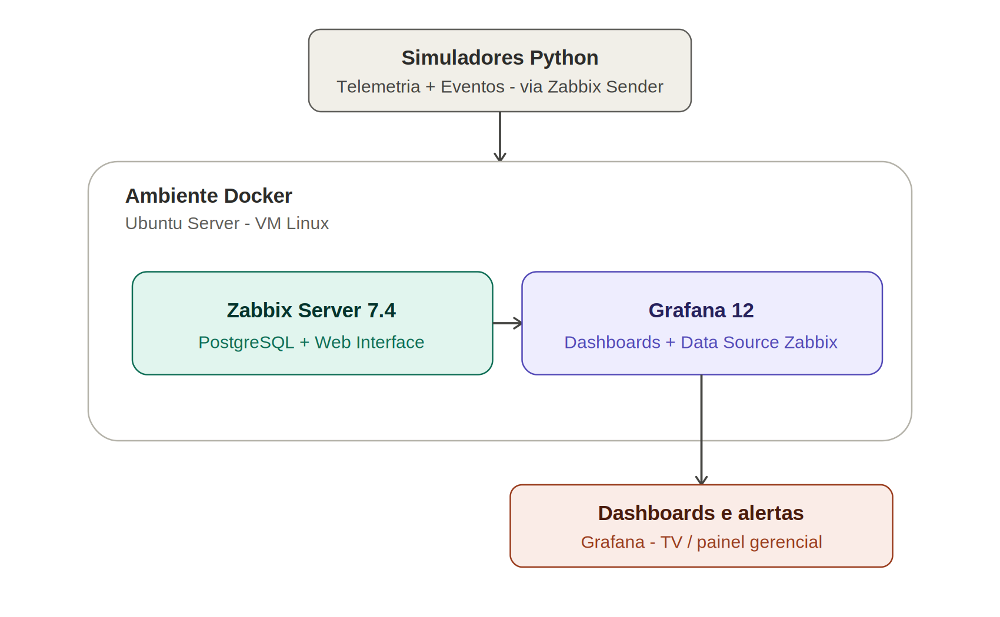
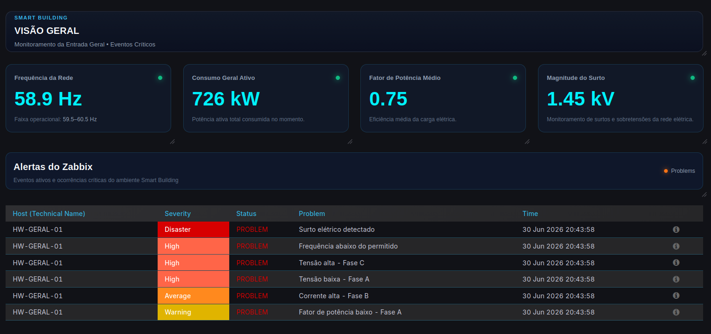
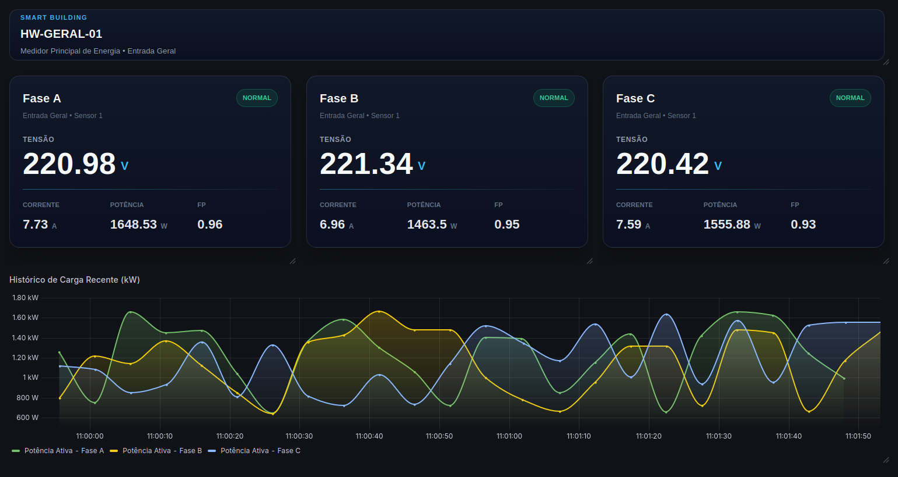

# SMART BUILDING LAB

Proof of Concept (PoC) para monitoramento elétrico utilizando Zabbix e Grafana.

---

## Objetivo

Validar uma plataforma de monitoramento elétrico utilizando dados simulados enviados por um script Python, permitindo acompanhar métricas em tempo real, histórico e alertas.

---

## Tecnologias

- Docker
- PostgreSQL
- Zabbix 7.4
- Grafana 12
- Python

---

## Arquitetura

---

## Dashboards

---

## Estrutura do Projeto

| Pasta | Descrição |
|--------|-----------|
| **docker/** | Arquivos para implantação do ambiente utilizando Docker Compose. |
| **python/** | Scripts responsáveis pela simulação das grandezas elétricas e eventos enviados ao Zabbix. |
| **zabbix/** | Template exportado do Zabbix e capturas de tela da configuração. |
| **grafana/** | Dashboards exportados em JSON, códigos HTML dos painéis Business Text e capturas de tela. |
| **docs/** | Documentação técnica da Prova de Conceito. |
| **images/** | Imagens utilizadas no README e na documentação do projeto. |

---

## Como executar

docker compose up -d

---
